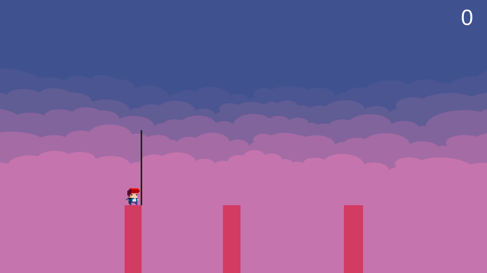
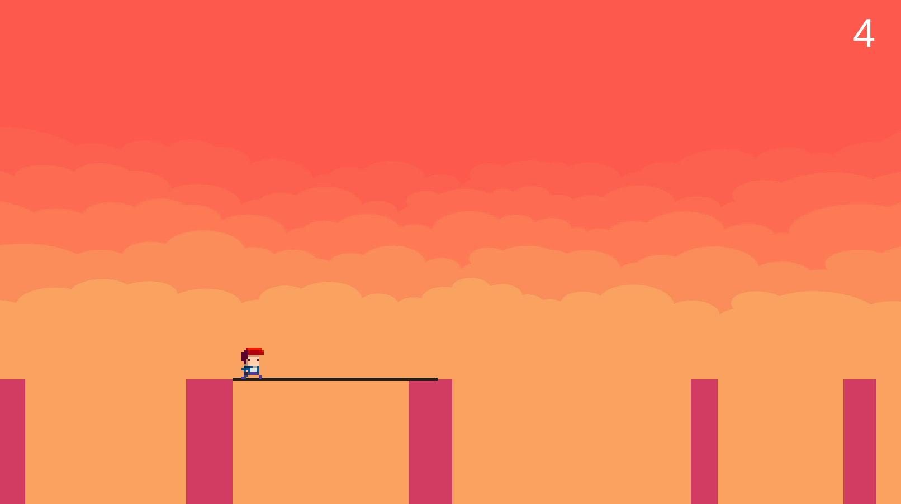
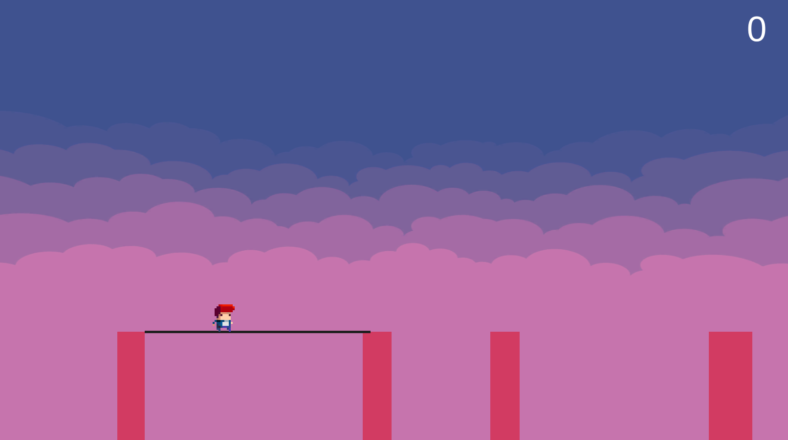

# StickWalker
The aim of the game is to precisely stretch a stick to the next pillar without it being too short or too long. Move your player along the pillars and collect points!

This casual game is a fully independent project and allowed me to use some of the skills learnt previously.

You can play the game in your web-browser here: [Stick Walker](https://oktarian.itch.io/stick-walker). How far can you go?

### Features & What I've learned:
* Random level generation
* Stretching the stick based on user-input, frame-independent
* Rotating the stick
* Detecting whether the end of stick is on the pillar using raycasting
* Moving the player to the next pillar or to the end of stick
* Game, level and score management (game over, reset, pause)
* Random skybox, SFX and camera positioning

&nbsp;

&nbsp;

&nbsp;

